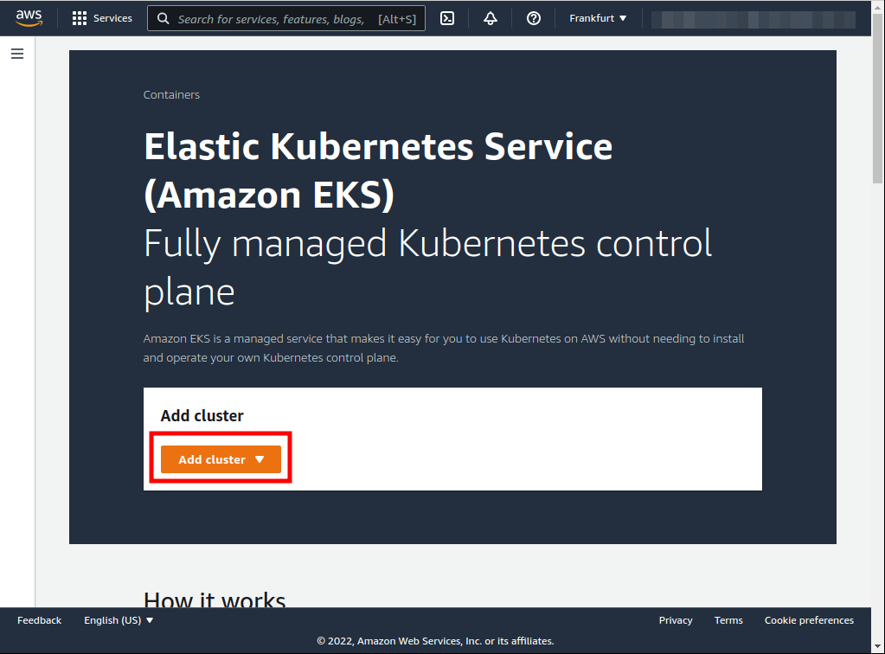

# Elastic Kubernetes Service (ECS) cluster creation

| [Previous](../00-signin/README.md) | [index](../README.md) | [next](../02-vpc-creation/README.md) |
| :--- | :--: | ---: |

| [Previous](../00-signin/README.md) | [index](../README.md) | [next](../02-vpc-creation/README.md) |
| :--- | :--: | ---: |