# Docker builder Virtual Private Compute (VPC) machine creation
| [Previous](../01-kubernetes-cluster-creation/README.md) | [index](../README.md) | [next](../03-creating-worker-nodes/README.md) |
| :--- | :--: | ---: |

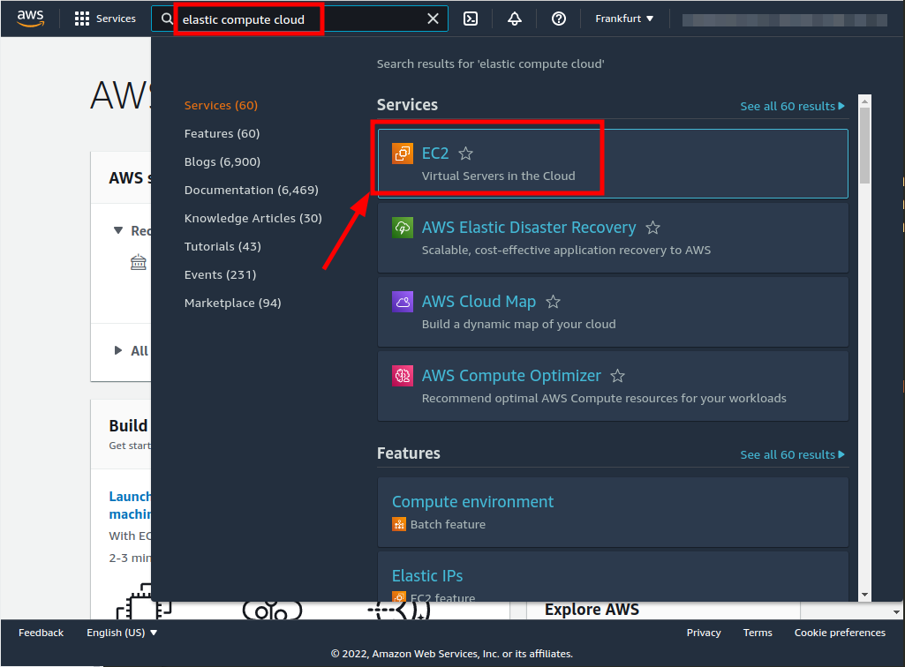
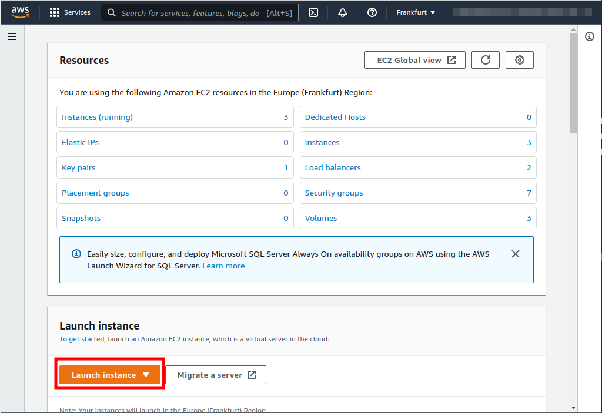
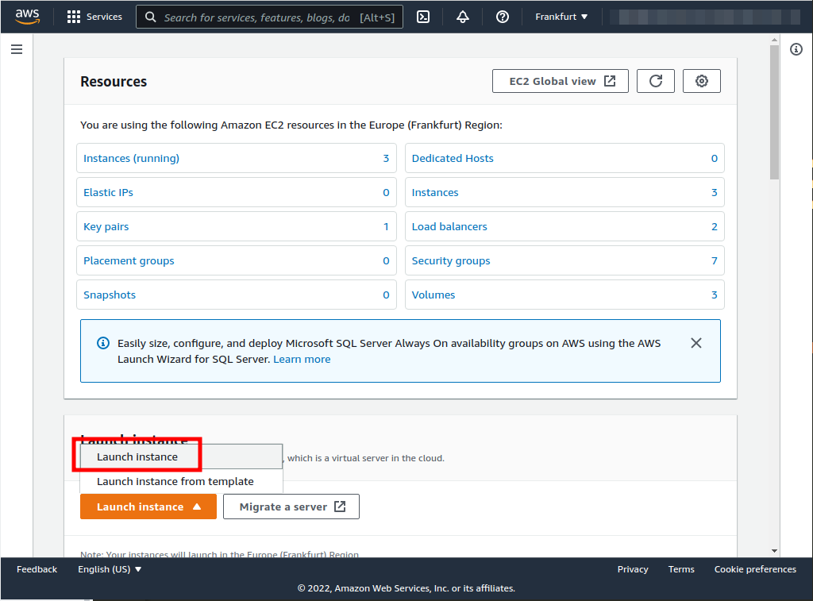
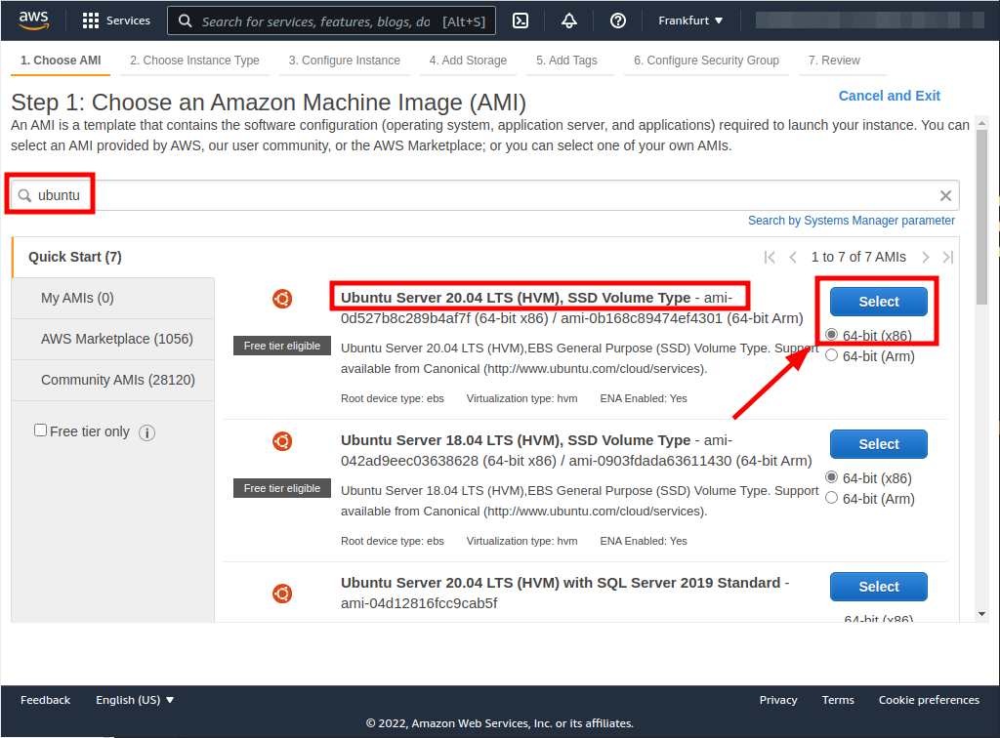
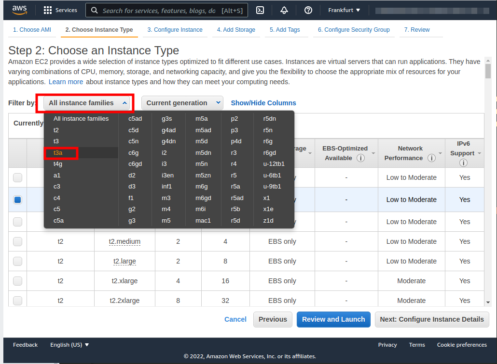
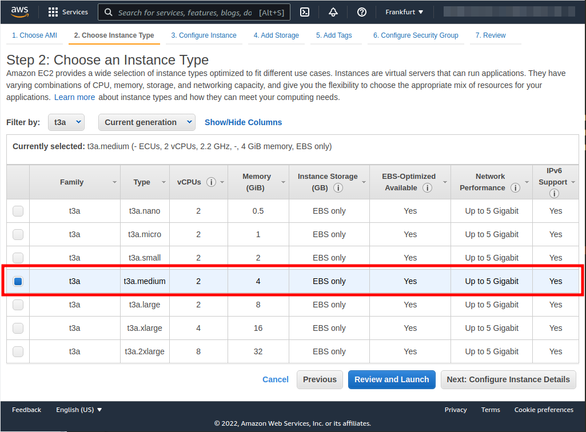
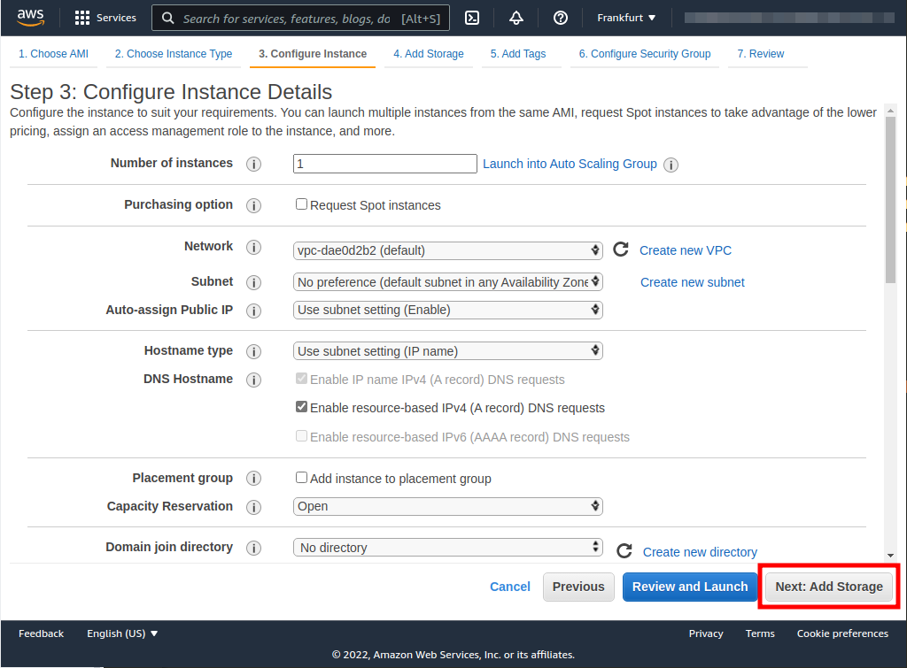
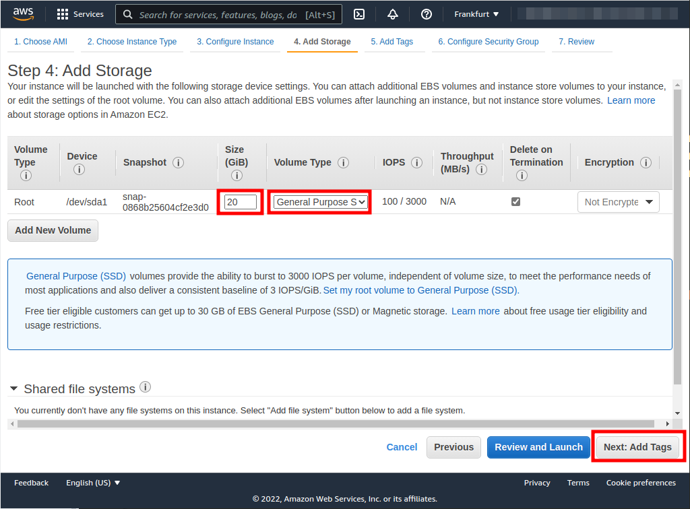
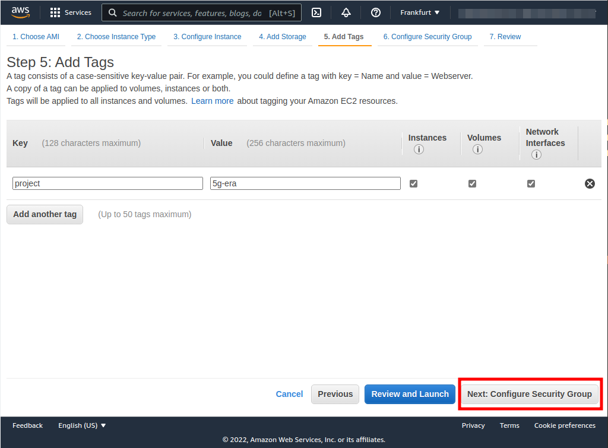
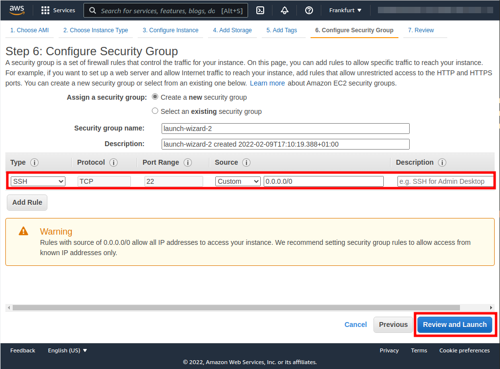
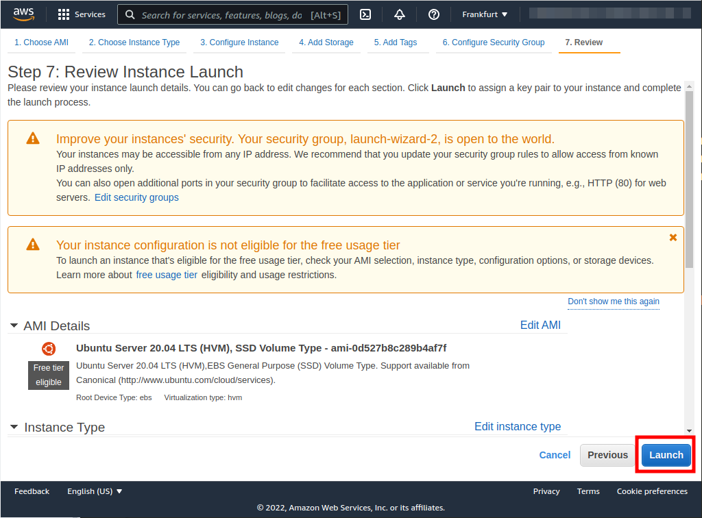
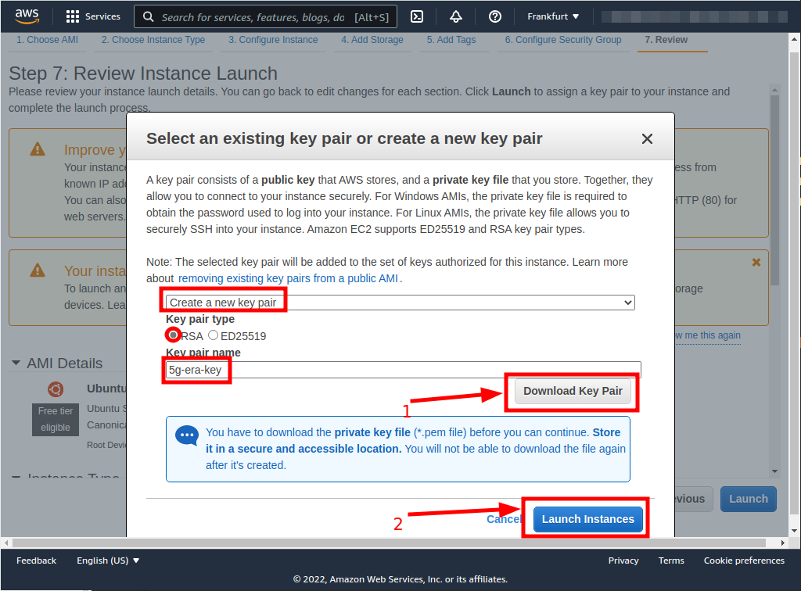
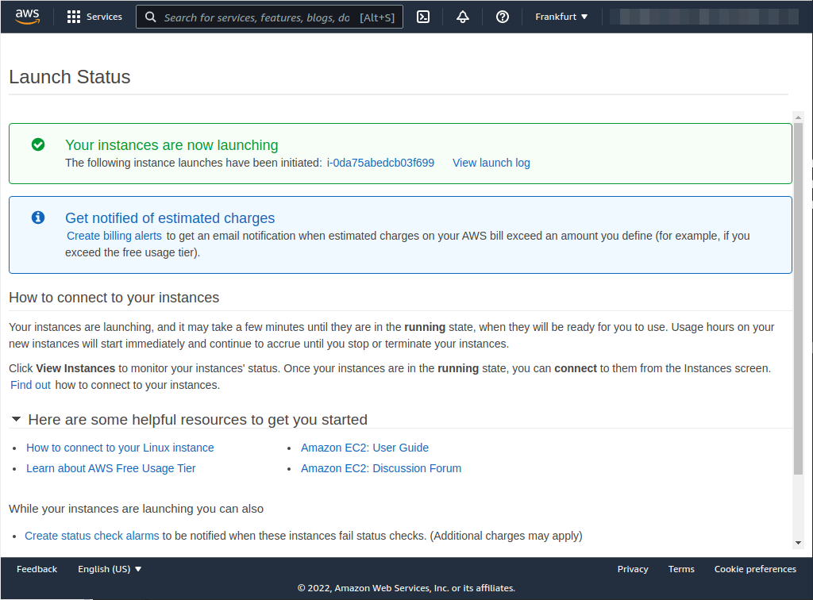

| [Previous](../01-kubernetes-cluster-creation/README.md) | [index](../README.md) | [next](../03-creating-worker-nodes/README.md) |
| :--- | :--: | ---: |
