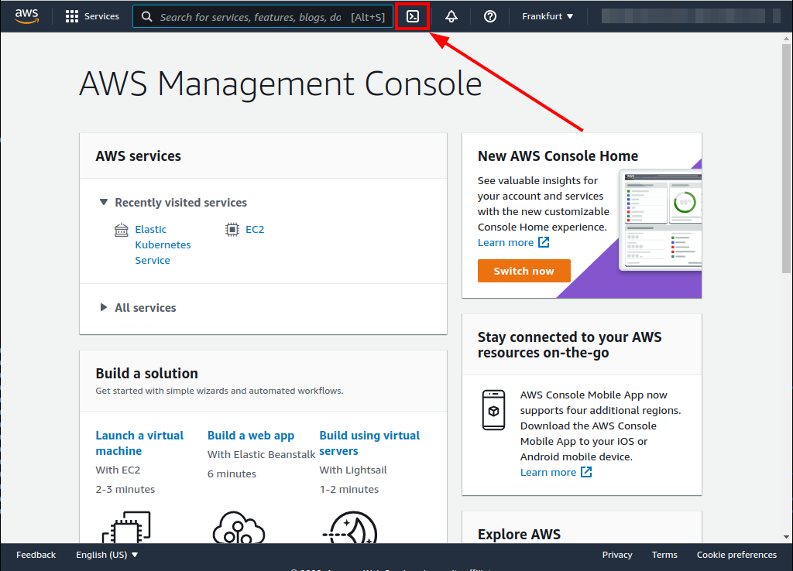
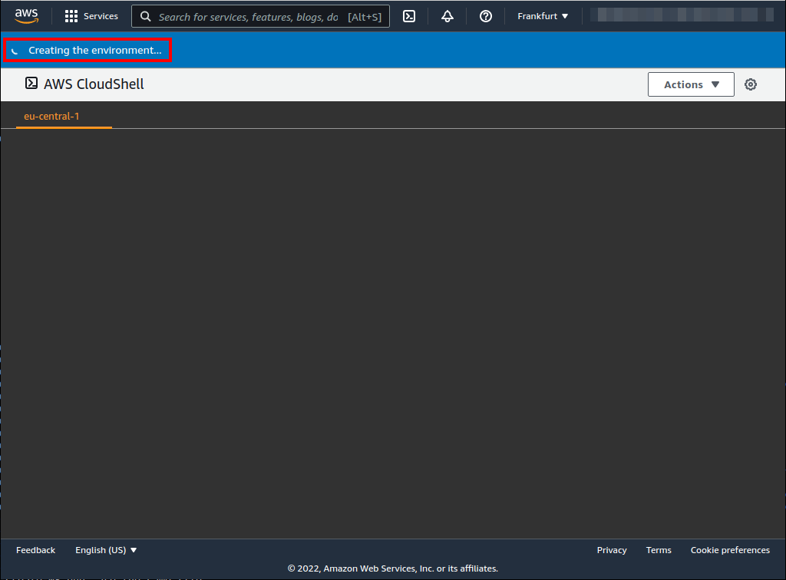
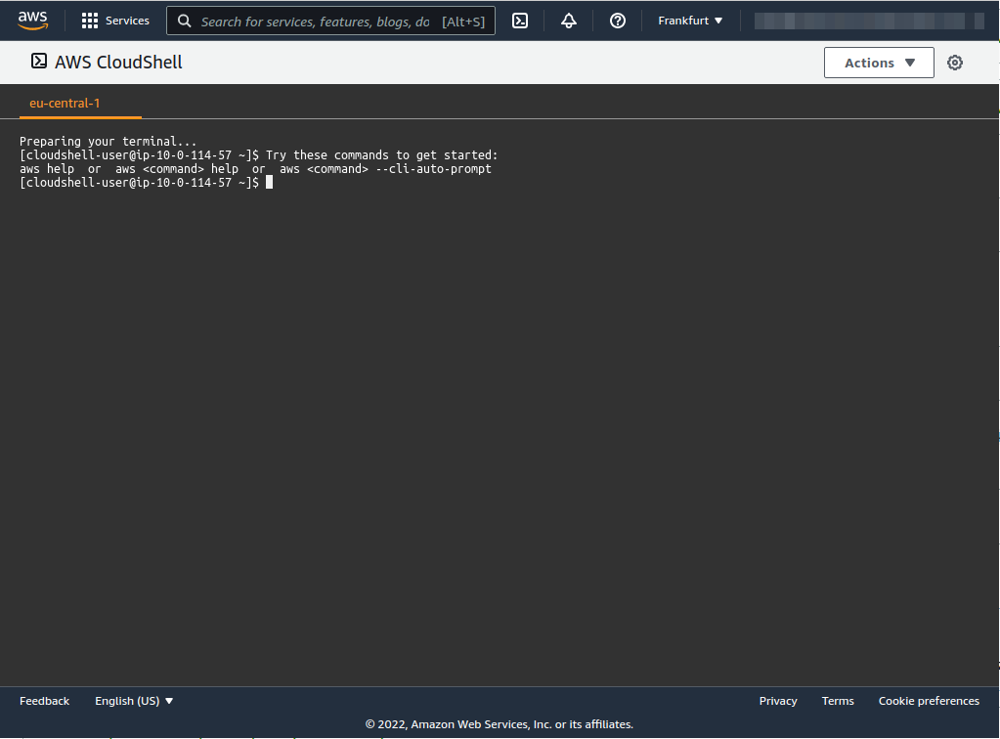
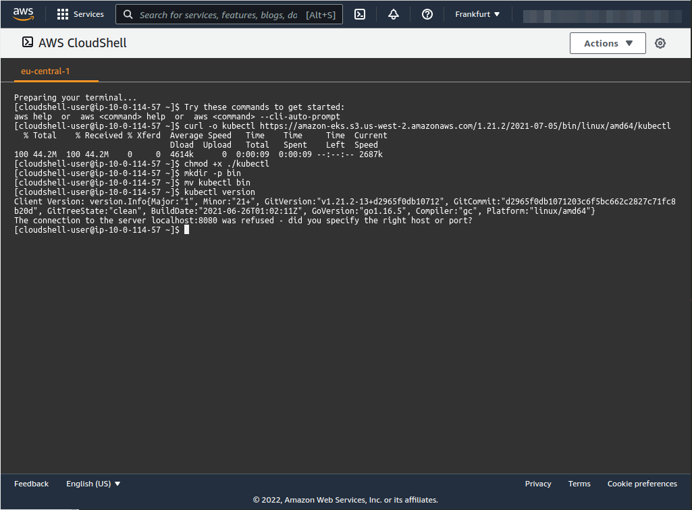
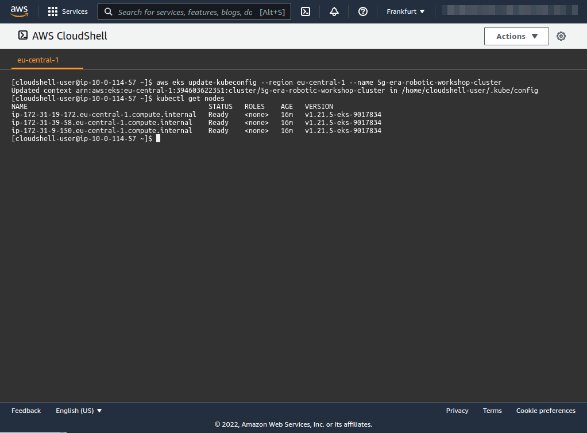

# kubectl install on AWS Cloud Console
| [Previous](../03-creating-worker-nodes/README.md) | [index](../README.md) | [next](../05-metrics-server/README.md) |
| :--- | :--: | ---: |

[commands](04-kubectl-cmd.txt)

| [Previous](../03-creating-worker-nodes/README.md) | [index](../README.md) | [next](../05-metrics-server/README.md) |
| :--- | :--: | ---: |