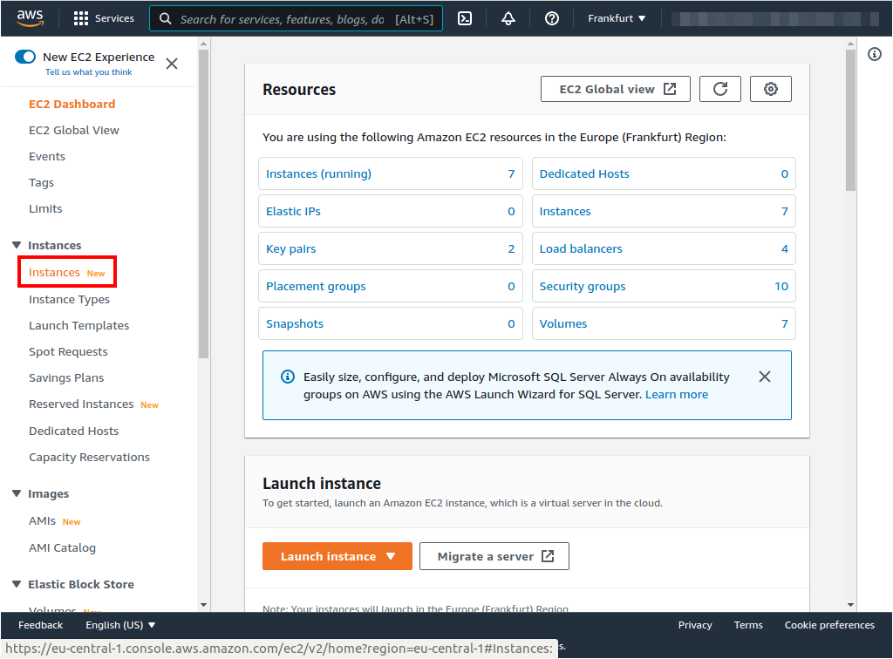

# VPC docker engine install
| [Previous](../06-deploy-robot-simulation/README.md) | [index](../README.md) | [next](../08-vpc-aws-cli-install/README.md) |
| :--- | :--: | ---: |

[commands](07-vpc-docker-cmd.txt)

## VPC access




## Docker install

```bash
sudo snap install docker
sudo groupadd docker
sudo usermod -aG docker $USER
newgrp docker
sudo reboot
```


## Docker installation check

```bash
docker run hello-world
```


| [Previous](../06-deploy-robot-simulation/README.md) | [index](../README.md) | [next](../08-vpc-aws-cli-install/README.md) |
| :--- | :--: | ---: |
