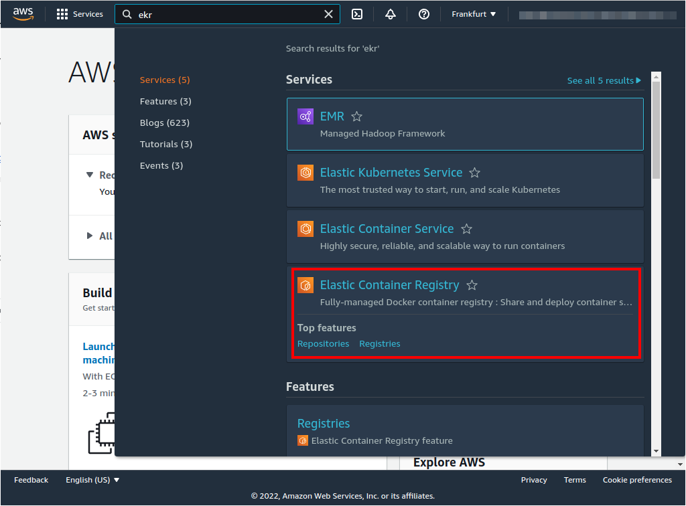
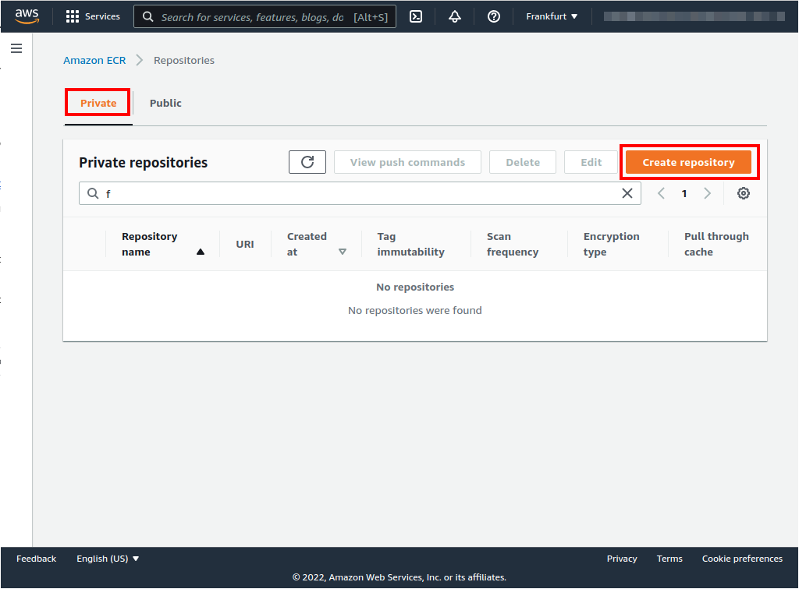
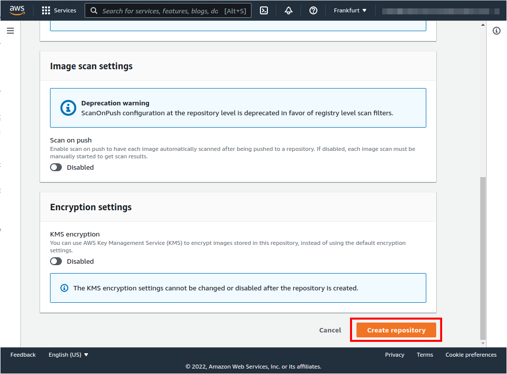
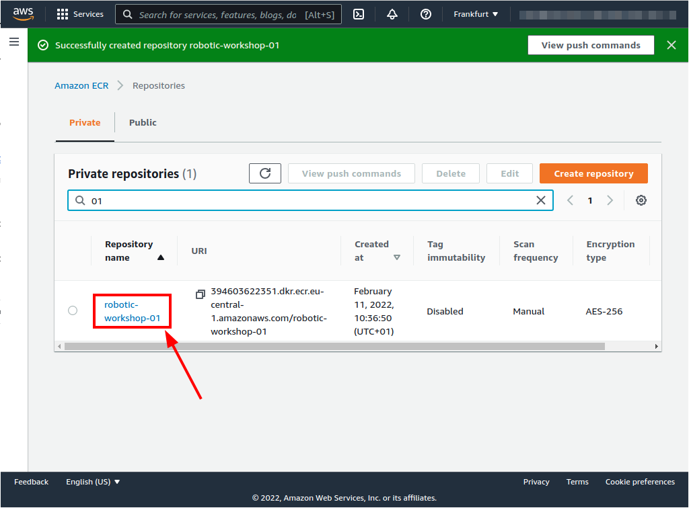
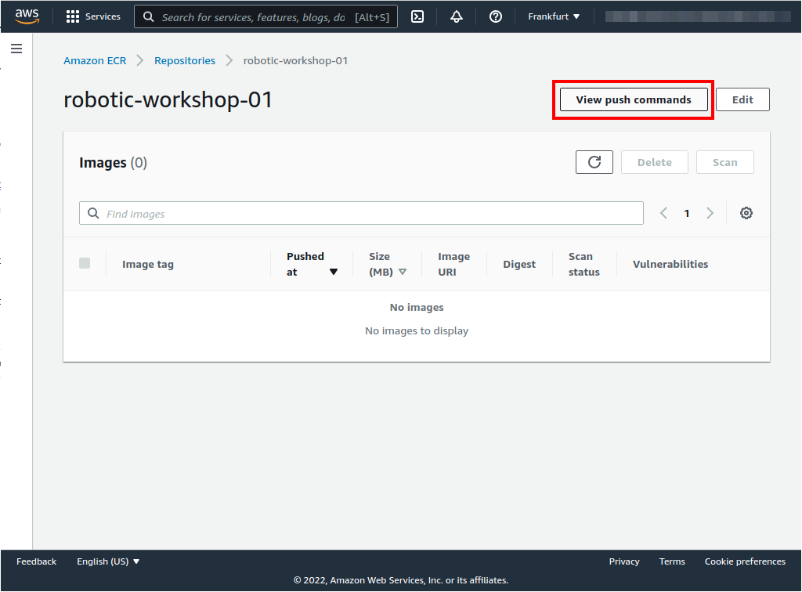
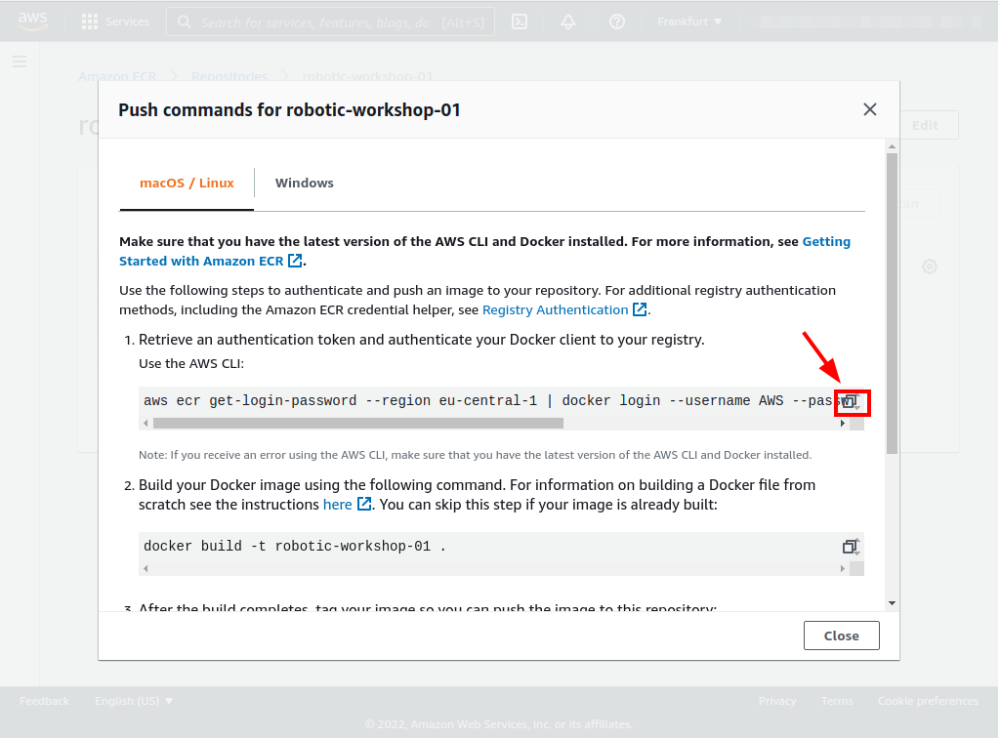
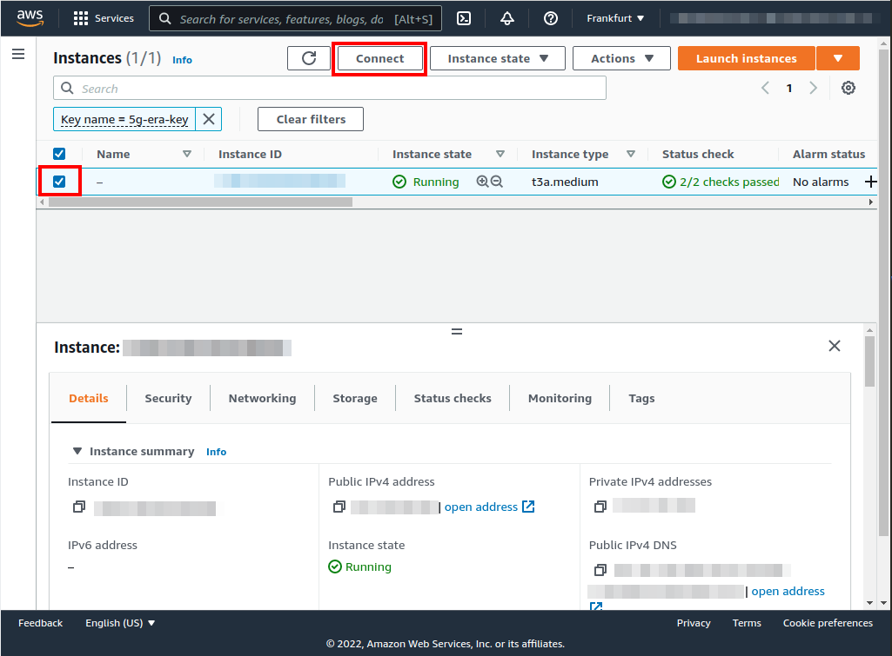
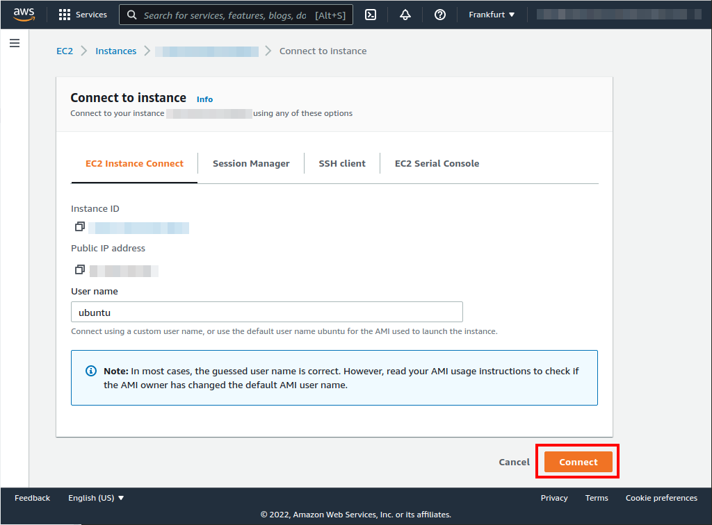
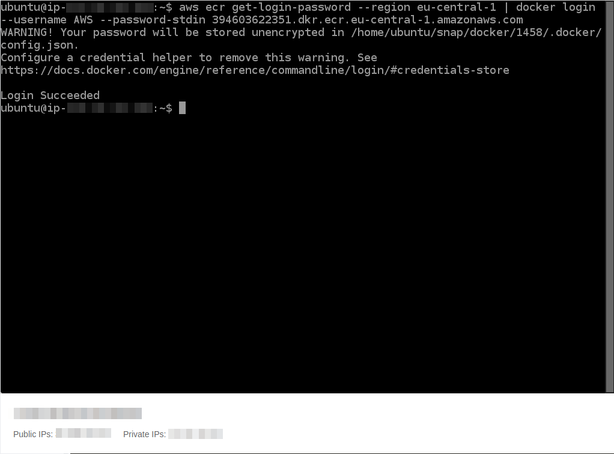

# Elastic Container Registry (ECR) creation
| [Previous](../07-vpc-aws-cli-install/README.md) | [index](../README.md) | [next](../09-docker-image-creation/README.md) |
| :--- | :--: | ---: |

[commands](08-registry-cmd.txt)

| [Previous](../07-vpc-aws-cli-install/README.md) | [index](../README.md) | [next](../09-docker-image-creation/README.md) |
| :--- | :--: | ---: |
