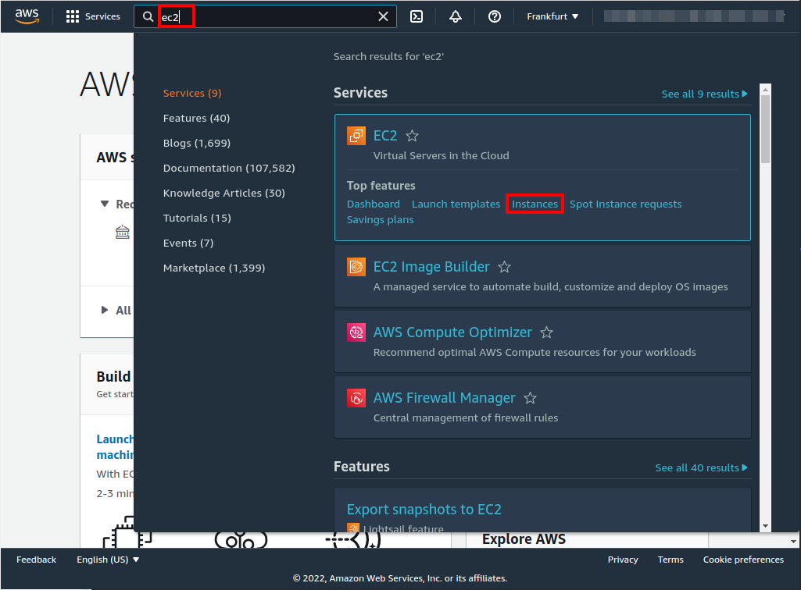

# Elastic Container Registry (ECR) creation
| [Previous](../07-vpc-aws-cli-install/README.md) | [index](../README.md) | [next](../09-docker-image-creation/README.md) |
| :--- | :--: | ---: |

[commands](08-registry-cmd.txt)

## Creating the registry





## Giving access to the registry to VPC

```bash
aws ecr get-login-password --region eu-central-1 | \
docker login --username AWS --password-stdin 394603622351.dkr.ecr.eu-central-1.amazonaws.com
```


| [Previous](../07-vpc-aws-cli-install/README.md) | [index](../README.md) | [next](../09-docker-image-creation/README.md) |
| :--- | :--: | ---: |
