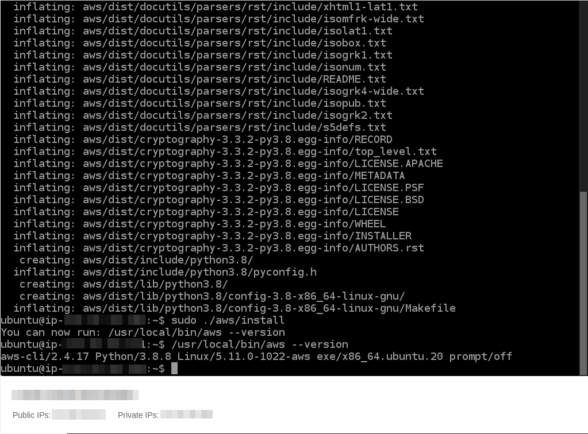
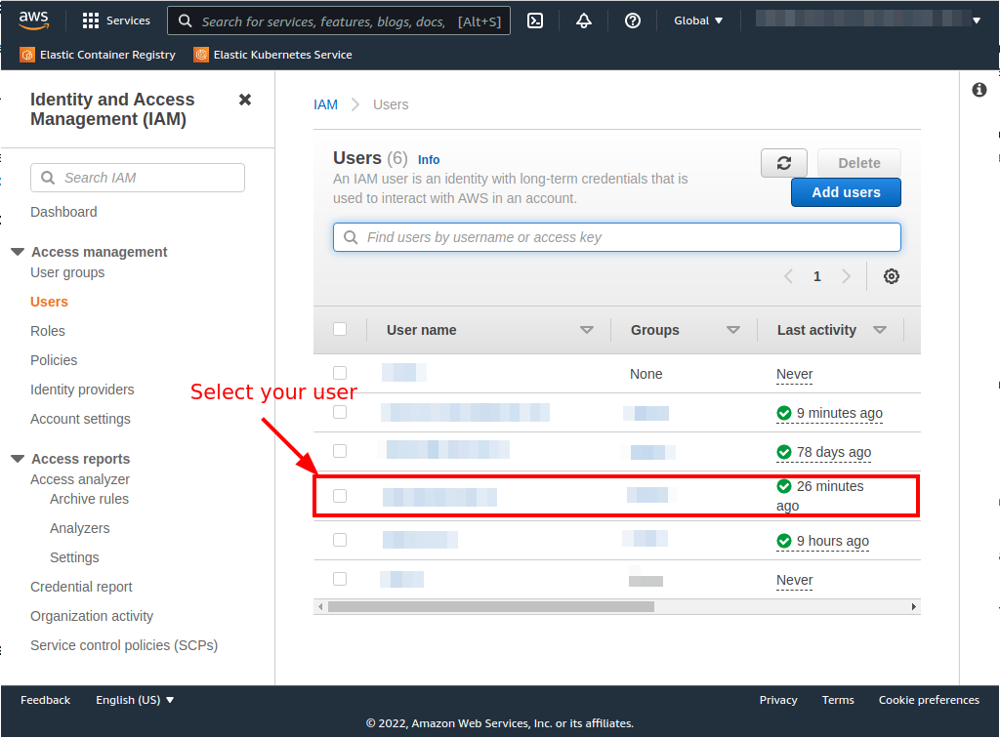
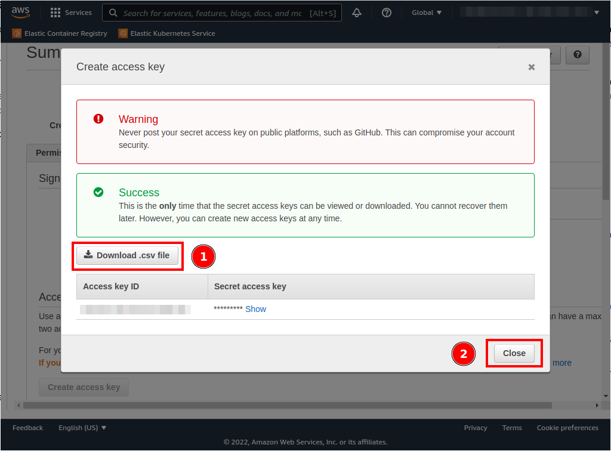

# VPC aws-cli install
| [Previous](../07-vpc-docker-install/README.md) | [index](../README.md) | [next](../09-registry-creation/README.md) |
| :--- | :--: | ---: |

[commands](08-vpc-aws-cmd.txt)

## Install aws-cli

```bash
sudo apt install -y unzip
curl "https://awscli.amazonaws.com/awscli-exe-linux-x86_64.zip" -o "awscliv2.zip"
unzip awscliv2.zip
sudo ./aws/install
aws --version
rm awscliv2.zip
```




## Getting credentials 






## Configuring aws-cli credentials

```bash
aws configure
```


| [Previous](../07-vpc-docker-install/README.md) | [index](../README.md) | [next](../09-registry-creation/README.md) |
| :--- | :--: | ---: |
