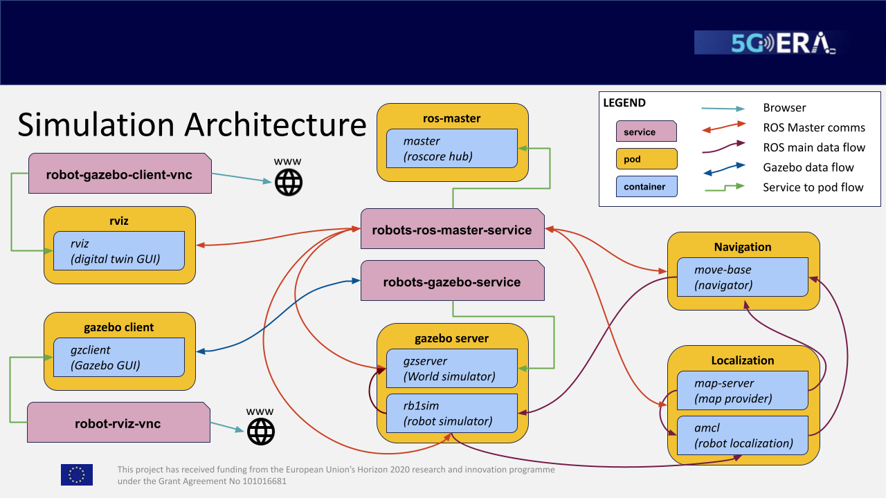
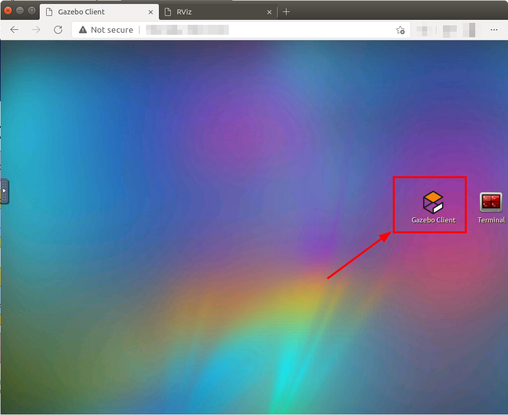
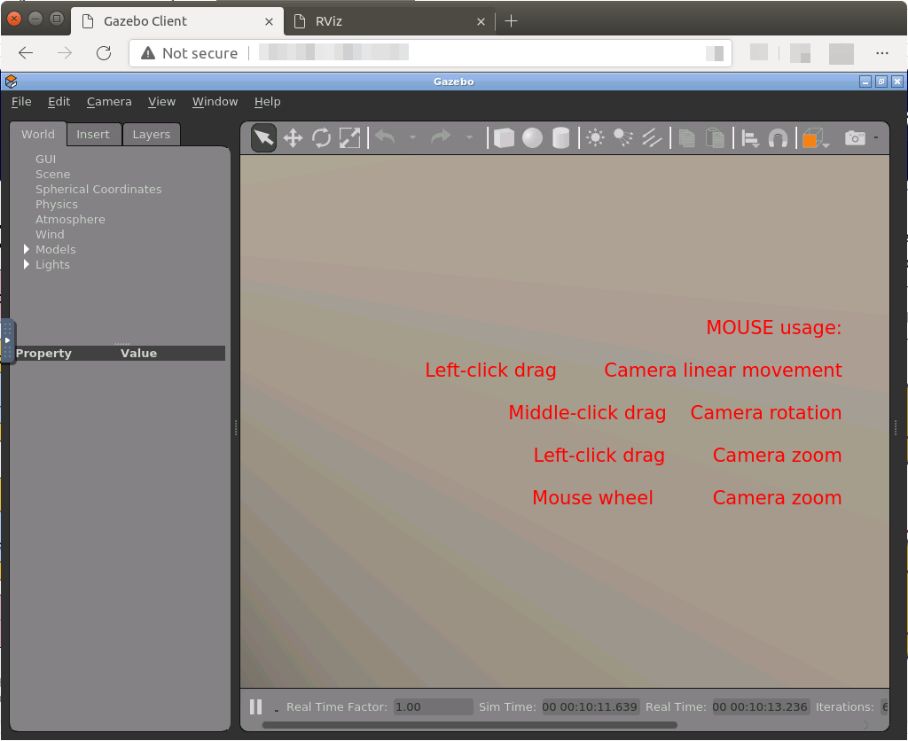
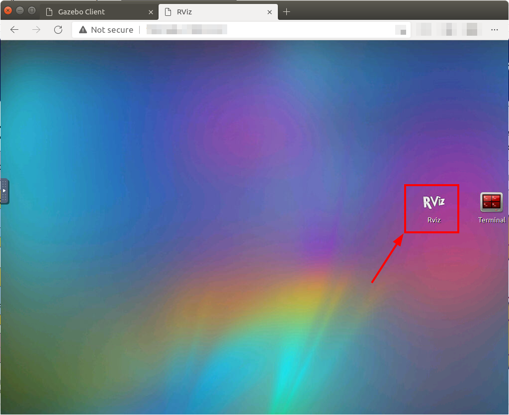
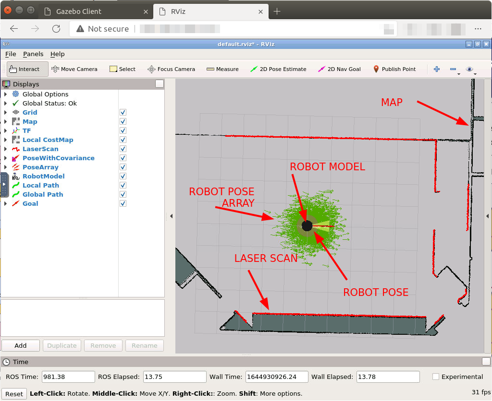
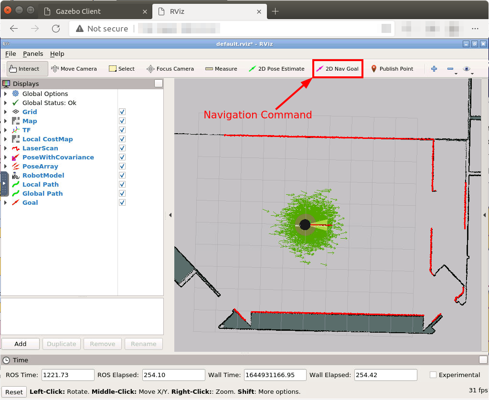

# Robot simulation kubernetes deployment
| [Previous](../08-registry-creation/README.md) | [index](../README.md) | [next](../10-docker-image-creation/README.md) |
| :--- | :--: | ---: |

[commands](09-deploy-robot-cmd.txt)

## deploy of the simulation


```bash
git clone https://github.com/5G-ERA/rb1_base_simulation_k8s.git
cd rb1_base_simulation_k8s
kubectl apply -f first-time/
kubectl apply -f pseudo-chart/
```

Check the state of the deployment using the following command:

```
kubectl get pods
```

Wait until everything should be on state "RUNNING" and READY


## Obtaining the URL

### Gazebo

For obtaining the gazebo client URL use the following commands:

```bash
echo "gazebo client website:"
echo http://$(kubectl get svc robot-gazebo-client-vnc -o jsonpath="{.status.loadBalancer.ingress[0].hostname}")
```

Paste the output on your browser new tab or window:

### Rviz

For obtaining the rviz URL use the following commands:

```bash
echo "Rviz client website:"
echo http://$(kubectl get svc robot-rviz-vnc -o jsonpath="{.status.loadBalancer.ingress[0].hostname}")
```

Paste the output on your browser new tab or window:

## Gazebo client





## Rviz






| [Previous](../08-registry-creation/README.md) | [index](../README.md) | [next](../10-docker-image-creation/README.md) |
| :--- | :--: | ---: |
