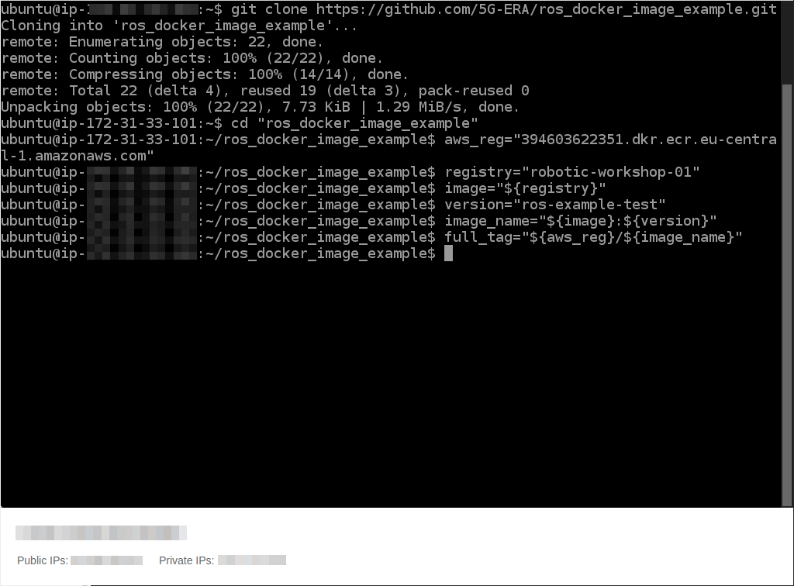
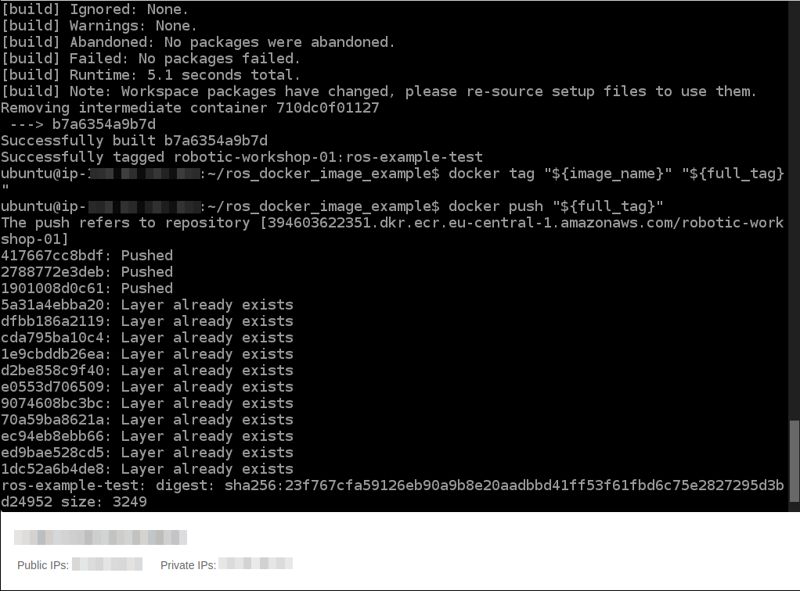

# ROS node example image build
| [Previous](../08-registry-creation/README.md) | [index](../README.md) | [next](../10-image-deployment/README.md) |
| :--- | :--: | ---: |
[commands](09-docker-image-cmd.txt)

| [Previous](../08-registry-creation/README.md) | [index](../README.md) | [next](../10-image-deployment/README.md) |
| :--- | :--: | ---: |
