# Elastic Container Registry (ECR) creation
| [Previous](../08-vpc-aws-cli-install/README.md) | [index](../README.md) | [next](../10-docker-image-creation/README.md) |
| :--- | :--: | ---: |
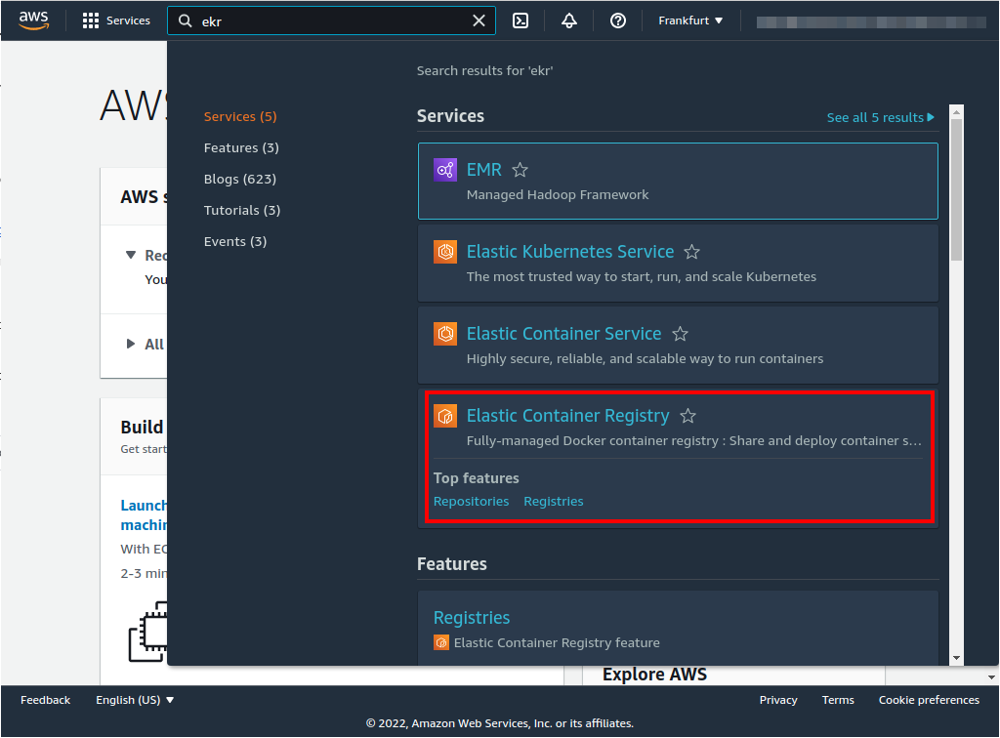
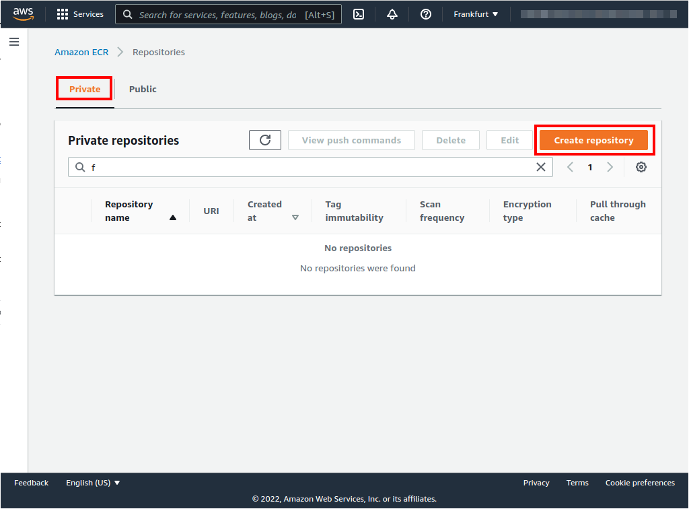
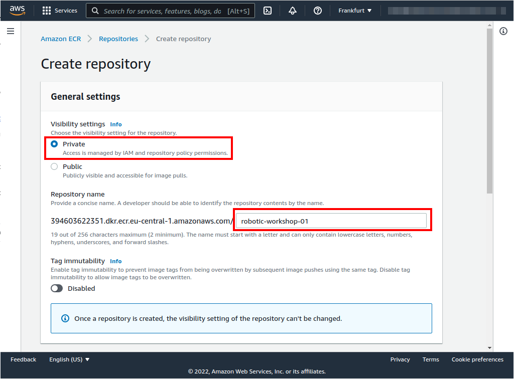
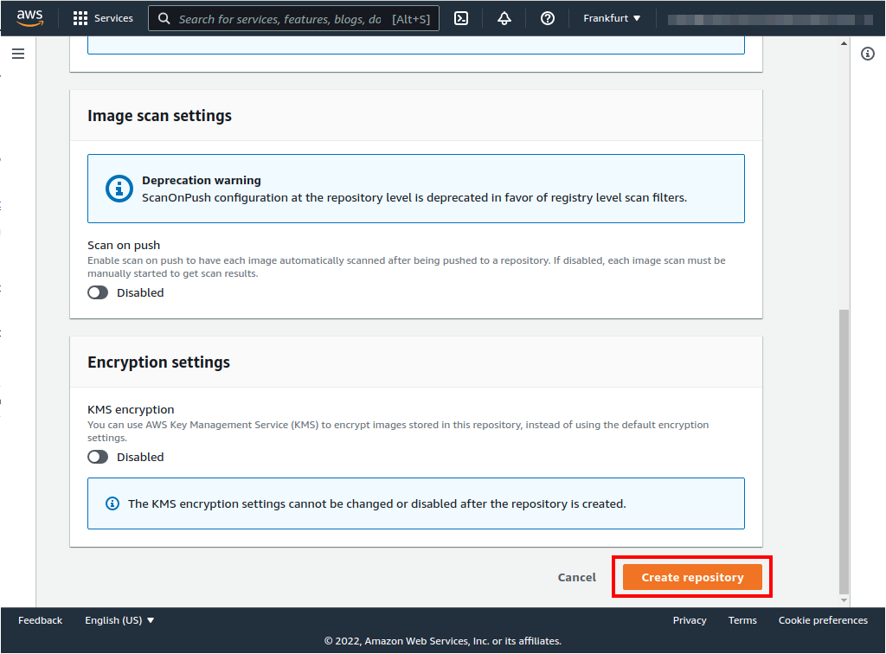
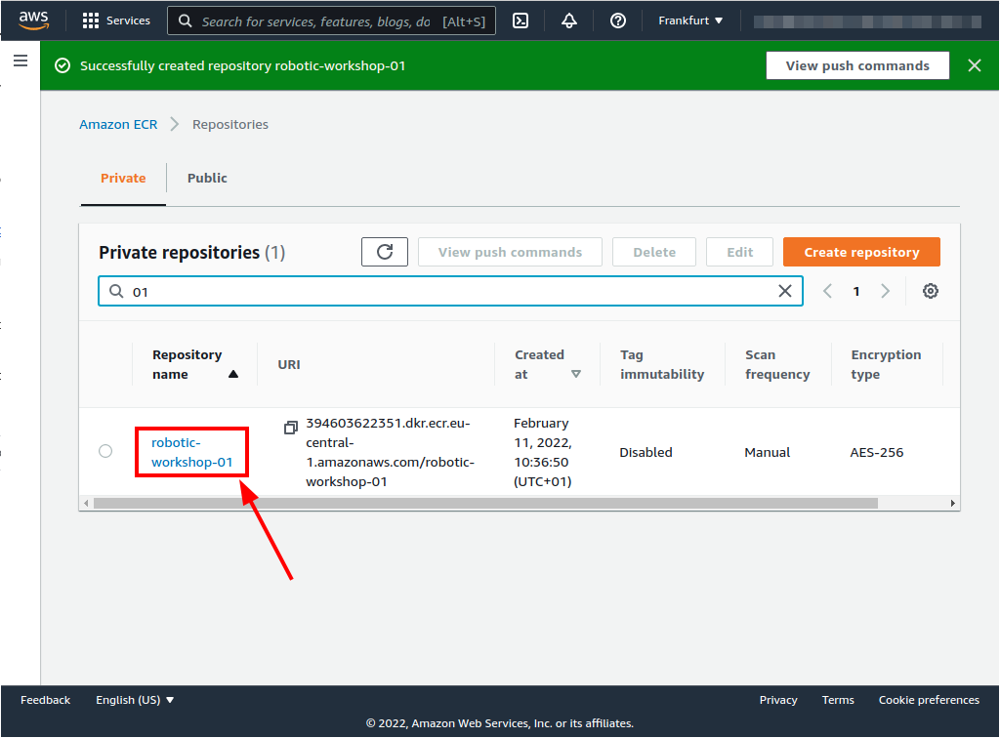
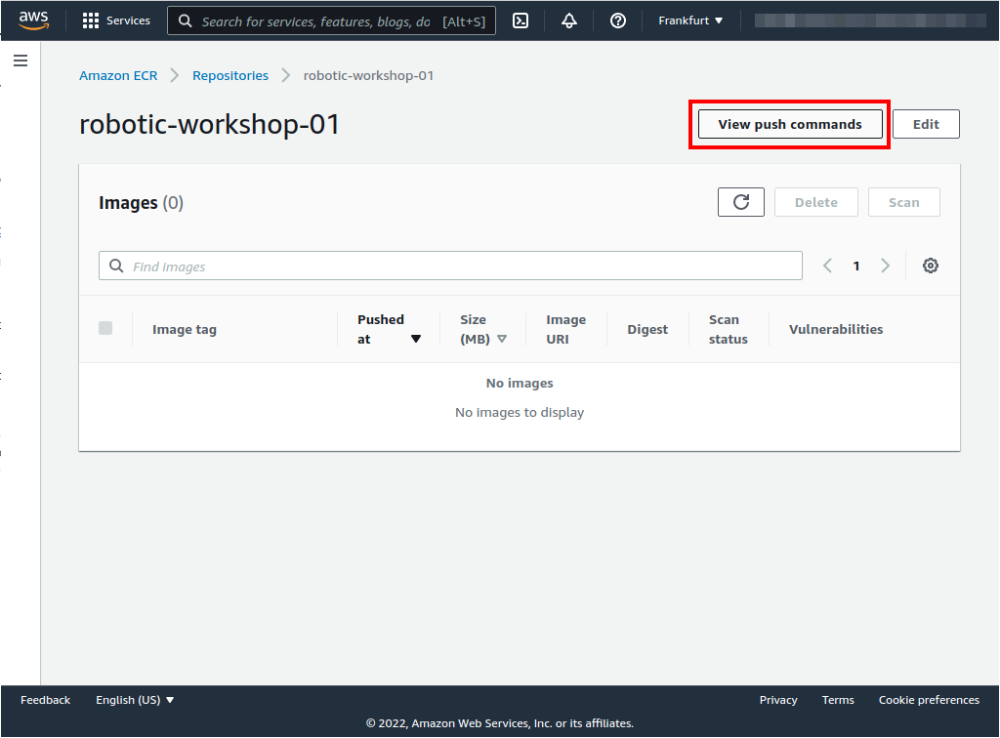
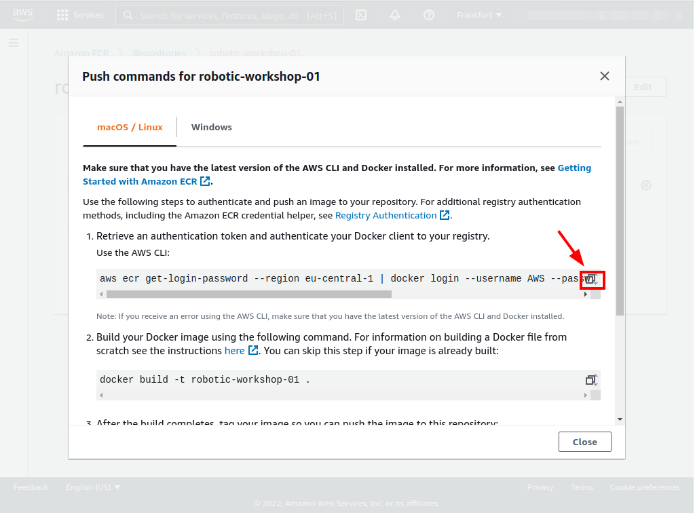
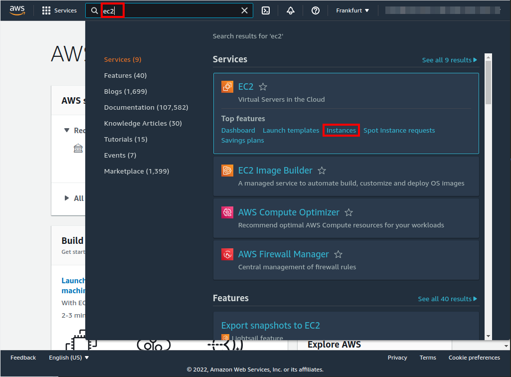
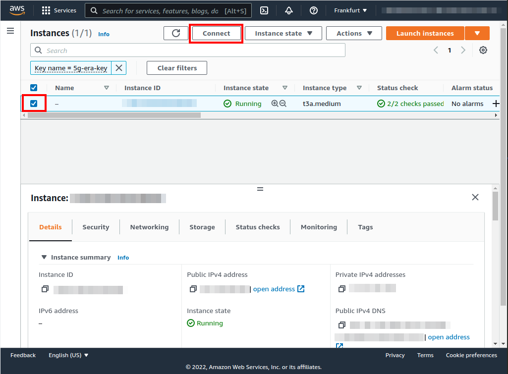
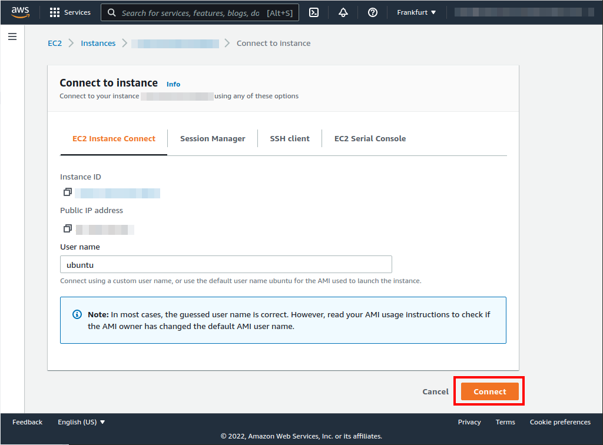
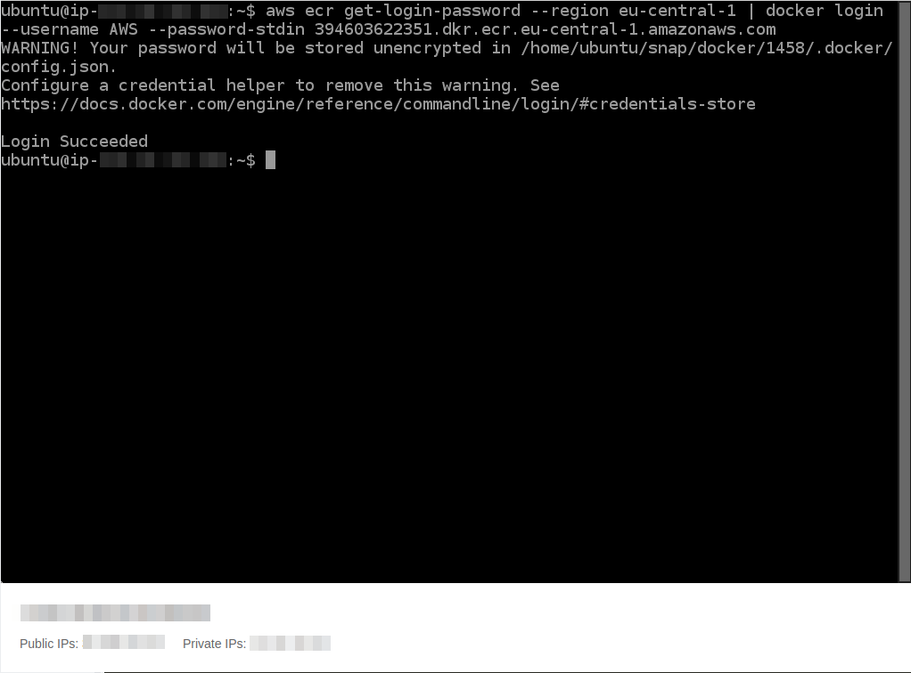
| [Previous](../08-vpc-aws-cli-install/README.md) | [index](../README.md) | [next](../10-docker-image-creation/README.md) |
| :--- | :--: | ---: |