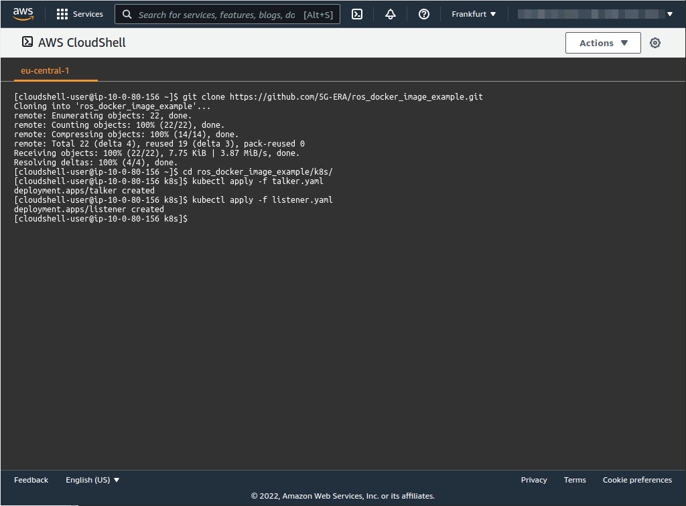
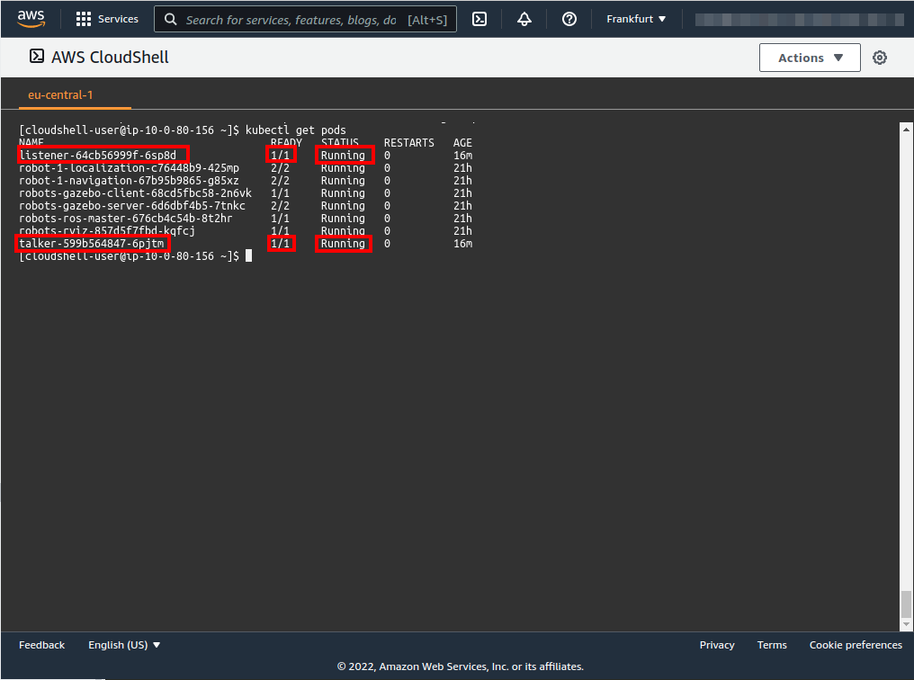
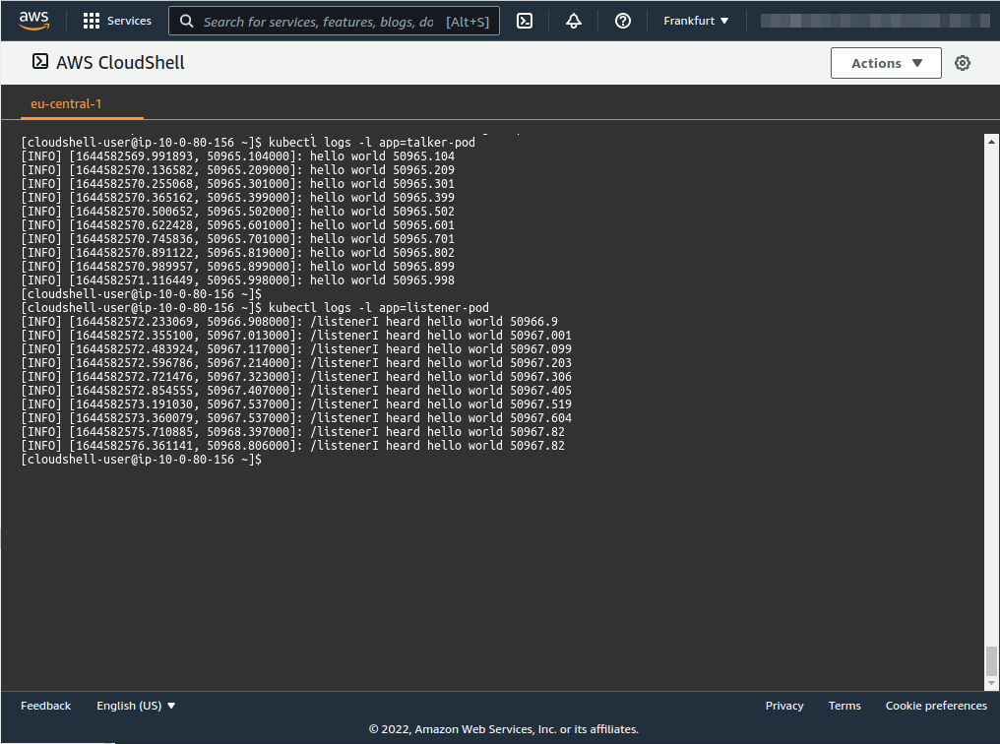

# ROS node example kubernetes deployment
| [Previous](../09-docker-image-creation/README.md) | [index](../README.md) | [next](../11-deploy-robot-simulation/README.md) |
| :--- | :--: | ---: |

[commands](10-deploy-image-cmd.txt)

| [Previous](../09-docker-image-creation/README.md) | [index](../README.md) | [next](../11-deploy-robot-simulation/README.md) |
| :--- | :--: | ---: |
